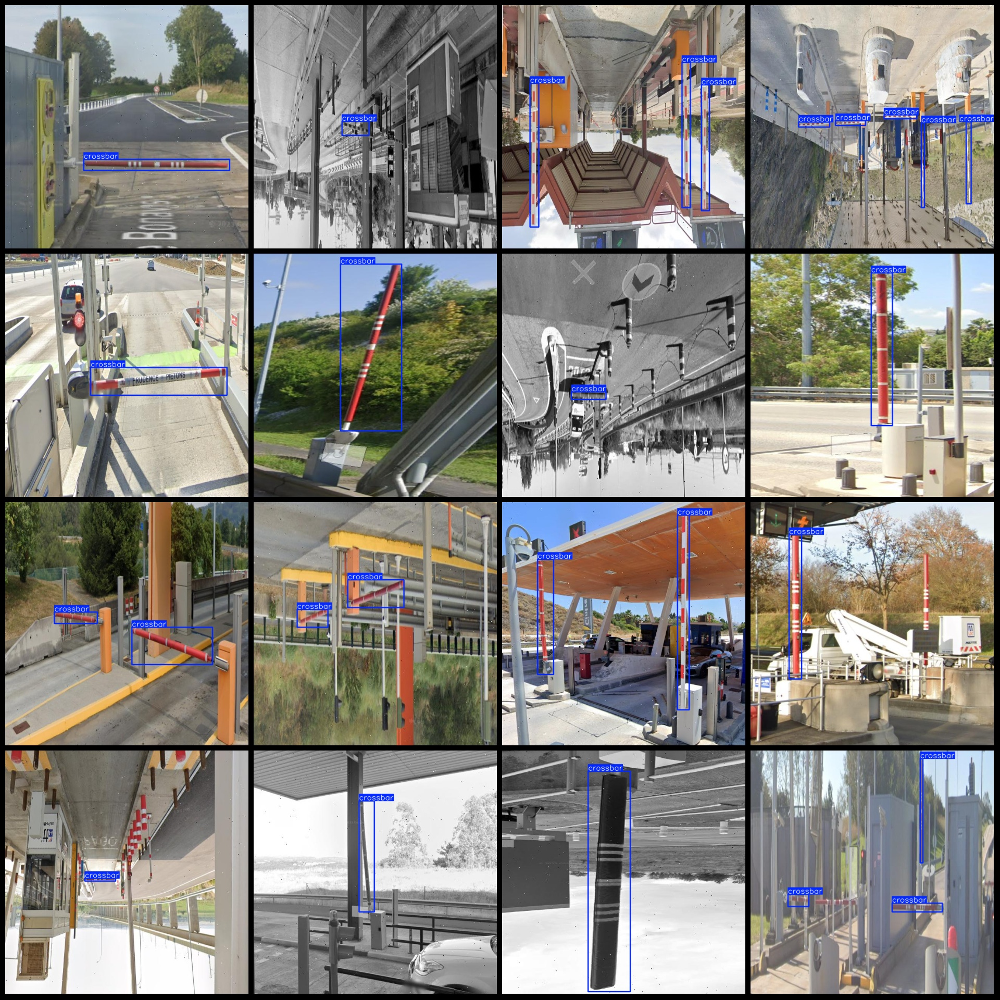
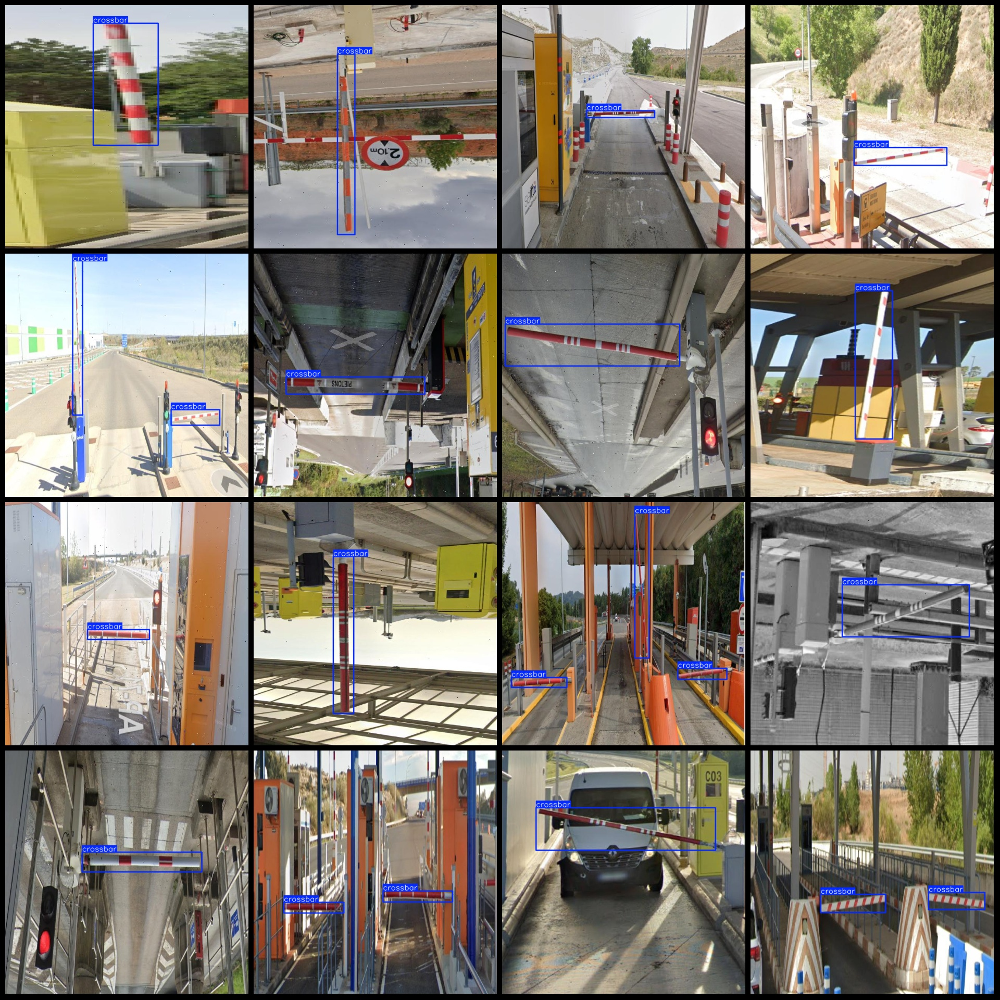

# Intelligent Park Entrance and Exit Gates Lifting Bar Detection Dataset - VOC+YOLO Format with 2869 Images in 1 Category with Enhanced

Please note that approximately 1000 images are original, while the remaining images are generated through rotation grayscale enhancement.

The dataset format is Pascal VOC format + YOLO format (excluding the split path in the txt file, only containing jpg images along with their corresponding VOC format xml files and yolo format txt 
files).

Number of images (jpg file count): 2869
Number of annotations (xml file count): 2869
Number of annotations (txt file count): 2869
Number of annotation categories: 1
Annotation category name: ["crossbar"]
Number of boxes per category:
crossbar box count = 4746
Total box count: 4746
Number of images each category occupies:
crossbar occupies images = 2869
Image resolution: 640x640
Annotation tool used: labelImg
Annotation rules: Draw a rectangular box around the category
Important Notice: The dataset does not have separate training, validation, or test sets; you will need to divide them yourself.
Special Note: This dataset does not guarantee the precision of the trained models or weight files.
Image Preview:
Annotation Example:

## Images

Here is a pay link on Stripe ( https://buy.stripe.com/3cs8yP7sY87d0vu9AB ). Please contact me lonlonago@foxmail.com after funding $89, and I will send you a complete data files , thank you!

